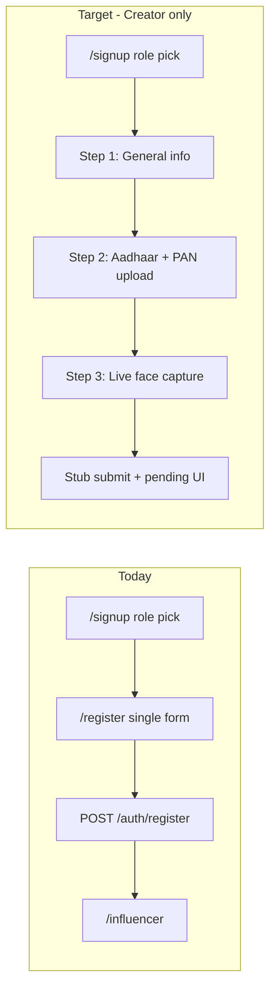

# Multi-Step Creator KYC Signup (Frontend)

## Scope (confirmed)

- **Creator registration only** — [`UserRegisterCard.tsx`](link-me-frontend/src/components/auth/UserRegisterCard.tsx) stays as-is
- **Frontend-only** — no `POST /auth/register` or `POST /auth/google` on final submit yet; show a success/pending state and keep draft data in memory for future API wiring
- **Google included** — Step 1 Google obtains an ID token via existing [`requestGoogleIdToken`](link-me-frontend/src/lib/google-auth.ts) but **does not** call `loginWithGoogle()` until backend is ready; token is stored in wizard draft and user proceeds to Steps 2–3

## Current vs target flow



Entry point stays [`RegisterExperience.tsx`](link-me-frontend/src/components/auth/RegisterExperience.tsx): when `role=creator`, render a new wizard instead of [`CreatorRegisterCard.tsx`](link-me-frontend/src/components/auth/CreatorRegisterCard.tsx).

## Architecture

### 1. Wizard orchestrator + shared state

Add [`src/components/auth/CreatorRegisterWizard.tsx`](link-me-frontend/src/components/auth/CreatorRegisterWizard.tsx) and [`src/hooks/useCreatorKycSignup.ts`](link-me-frontend/src/hooks/useCreatorKycSignup.ts).

Draft shape (local types in [`src/lib/kyc/types.ts`](link-me-frontend/src/lib/kyc/types.ts)):

```ts
type CreatorKycDraft = {
  step: 1 | 2 | 3
  authMethod: 'email' | 'google' | null
  profile: { name; username; email; password } | null
  googleIdToken: string | null
  documents: { aadhaar: File | null; pan: File | null }
  selfie: Blob | null
}
```

Hook responsibilities:
- `nextStep()` / `prevStep()` with validation gates
- `setProfile()`, `setGoogleToken()`, `setDocument()`, `setSelfie()`
- `submitKyc()` — **stub only**: simulate delay, `console.debug` draft summary (no PII blobs), return success

Persist draft in React state only (no localStorage — KYC images should not be cached on disk pre-backend).

### 2. Step indicator UI

Add [`src/components/kyc/KycStepIndicator.tsx`](link-me-frontend/src/components/kyc/KycStepIndicator.tsx):
- 3 labeled steps: **Account**, **Documents**, **Face verify**
- Reuse creator accent styling from [`RegisterGlassCard`](link-me-frontend/src/components/auth/RegisterGlassCard.tsx) (fuchsia/violet gradient)
- Show current/completed/upcoming states; respect `useReducedMotion`

### 3. Step 1 — General information (extract existing UI)

Add [`src/components/kyc/CreatorSignupStepGeneral.tsx`](link-me-frontend/src/components/kyc/CreatorSignupStepGeneral.tsx) by extracting the form/header/Google block from [`CreatorRegisterCard.tsx`](link-me-frontend/src/components/auth/CreatorRegisterCard.tsx).

Changes from today:
- Primary CTA becomes **Next** (not “Create Creator Account”)
- Email path: validate required fields + `minLength={8}` password + username sanitization (same as today), then advance
- Google path: call `requestGoogleIdToken('signup')`, store token, set `authMethod: 'google'`, advance — **no router push, no auth store call**
- Keep role-switch and login links at bottom

Optional small improvement (low scope): apply shared Zod [`registerSchema`](link-me-frontend/packages/shared/src/schemas.ts) client-side for clearer field errors before advancing.

### 4. Step 2 — Document upload (Aadhaar + PAN)

Add [`src/components/kyc/KycDocumentUploadStep.tsx`](link-me-frontend/src/components/kyc/KycDocumentUploadStep.tsx) and [`src/components/kyc/DocumentUploadField.tsx`](link-me-frontend/src/components/kyc/DocumentUploadField.tsx).

Behavior:
- Two upload slots: **Aadhaar card** and **PAN card**
- Accept `image/jpeg,image/png,image/webp` only; max ~5MB each (client-side check)
- Drag-and-drop + click-to-browse (pattern inspired by [`MediaDropzone.tsx`](link-me-frontend/src/components/creator-studio/create-post/MediaDropzone.tsx) but **local preview only** — no Cloudinary/`media-upload` calls yet)
- Show thumbnail preview, file name, replace/remove actions
- **Next** disabled until both documents selected
- **Back** returns to Step 1 without losing draft

Copy: brief KYC helper text (“Ensure details are readable, no glare”).

### 5. Step 3 — Live face capture

Add:
- [`src/hooks/useCamera.ts`](link-me-frontend/src/hooks/useCamera.ts) — `getUserMedia({ video: { facingMode: 'user' } })`, stream lifecycle, permission/error states, cleanup on unmount
- [`src/lib/kyc/captureFrame.ts`](link-me-frontend/src/lib/kyc/captureFrame.ts) — draw `<video>` frame to canvas → JPEG `Blob`
- [`src/components/kyc/KycFaceCaptureStep.tsx`](link-me-frontend/src/components/kyc/KycFaceCaptureStep.tsx)

UI flow (aligned with ABCoin backend contract — capture client-side, verify server-side later):
1. **Start camera** button (user gesture required for permission)
2. Live `<video>` preview in rounded frame with face-alignment overlay hint
3. **Capture** → freeze preview from canvas; allow **Retake**
4. **Submit verification** (final CTA) calls stub `submitKyc()`

Error handling: permission denied, no camera, insecure context — show actionable messages.

No MediaPipe/InsightFace in browser (ABCoin service handles matching server-side).

### 6. Stub completion screen

Add [`src/components/kyc/KycSubmissionPending.tsx`](link-me-frontend/src/components/kyc/KycSubmissionPending.tsx):
- Success state after stub submit
- Message: verification is pending; backend integration coming soon
- Dev-only note that draft was logged (not shown in production UI)
- Button: “Go to home” → `/` (not `/influencer` since no real auth yet)

### 7. Wire into register page

Update [`RegisterExperience.tsx`](link-me-frontend/src/components/auth/RegisterExperience.tsx):

```tsx
{role === 'creator' ? (
  <CreatorRegisterWizard
    initialUsername={initialUsername}
    onSwitchRole={() => switchRole('user')}
  />
) : (
  <UserRegisterCard ... />
)}
```

Keep [`CreatorRegisterCard.tsx`](link-me-frontend/src/components/auth/CreatorRegisterCard.tsx) temporarily as a thin re-export or delete after extraction (prefer delete to avoid drift).

## File map (new / changed)

| Action | File |
|--------|------|
| New | `src/hooks/useCreatorKycSignup.ts` |
| New | `src/hooks/useCamera.ts` |
| New | `src/lib/kyc/types.ts`, `src/lib/kyc/captureFrame.ts` |
| New | `src/components/kyc/KycStepIndicator.tsx` |
| New | `src/components/kyc/CreatorSignupStepGeneral.tsx` |
| New | `src/components/kyc/KycDocumentUploadStep.tsx` |
| New | `src/components/kyc/DocumentUploadField.tsx` |
| New | `src/components/kyc/KycFaceCaptureStep.tsx` |
| New | `src/components/kyc/KycSubmissionPending.tsx` |
| New | `src/components/auth/CreatorRegisterWizard.tsx` |
| Edit | `src/components/auth/RegisterExperience.tsx` |
| Remove/deprecate | `src/components/auth/CreatorRegisterCard.tsx` |

## Backend-ready hooks (not implemented now)

Structure draft + stub submit so later backend work is a swap, not a rewrite:

```ts
// future: src/lib/kyc/submit-kyc.ts
// 1. POST /auth/register OR /auth/google (using draft.profile or draft.googleIdToken)
// 2. POST /kyc/presign for aadhaar, pan, selfie
// 3. PUT blobs to presigned URLs
// 4. POST /kyc/submit → enqueue ABCoin face verify (selfie vs Aadhaar face)
// 5. Poll GET /kyc/status → APPROVED / REJECTED / PENDING
```

Reference contract: [`ABCoin-facial-recognition/docs/node-integration-face-verify.md`](ABCoin-facial-recognition/docs/node-integration-face-verify.md) — selfie + ID face image URLs, async verification.

## Verification checklist (manual, frontend-only)

1. `/register?role=creator` shows 3-step indicator and Step 1 form matching current fields
2. Email path: invalid fields block **Next**; valid fields advance to documents
3. Google path: token obtained, advances to Step 2 without redirect/login
4. Step 2: cannot proceed without both Aadhaar and PAN; previews render; **Back** preserves Step 1 data
5. Step 3: camera permission flow works on localhost HTTPS or deployed preview; capture/retake works
6. Final stub submit shows pending screen; no network calls to `/auth/*`
7. `/register?role=user` unchanged

## Out of scope (this pass)

- Fan/user KYC
- Real uploads (Cloudinary/S3) and KYC API routes
- Server-side face matching / liveness (ABCoin Python service)
- Post-signup redirect to `/influencer` or KYC status polling
- Persisting draft across page refresh
